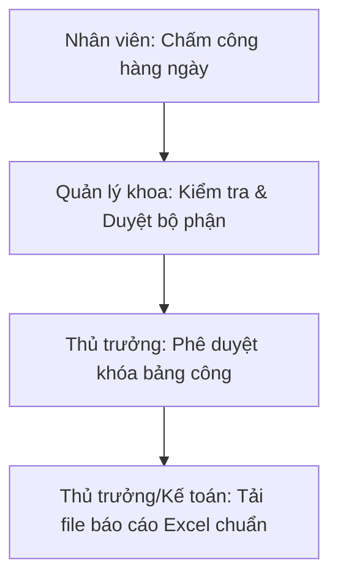

# HƯỚNG DẪN SỬ DỤNG HỆ THỐNG CHẤM CÔNG
### TRẠM Y TẾ PHƯỜNG HẢI VÂN

Chào mừng các bạn đến với Hệ thống Quản lý Chấm công & Phụ cấp Độc hại của Trạm Y tế phường Hải Vân. Hệ thống hỗ trợ chấm công trực tuyến hàng ngày, tự động tổng hợp số liệu và kết xuất báo cáo Excel chuẩn 107 (4 sheet).

---

## 🔑 1. Danh sách Tài khoản & Quyền hạn

Dưới đây là danh sách tài khoản đã được cài đặt sẵn để kiểm thử các vai trò khác nhau trong hệ thống:

| STT | Tài khoản (Mã NV) | Họ và Tên | Chức danh hiển thị | Quyền hạn trong hệ thống | Mật khẩu mặc định |
| :--- | :--- | :--- | :--- | :--- | :--- |
| **1** | `admin` | Quản trị viên Hệ thống | Quản trị viên | Quản trị hệ thống, quản lý danh sách nhân sự | `admin123` |
| **2** | `director` | Bác sĩ Nguyễn Văn Trưởng | Trưởng trạm | **Thủ trưởng**: Xem toàn đơn vị, khóa sổ công và xuất Excel | `director123` |
| **3** | `hieu.nth` | Nguyễn Thị Hoàng Hiếu | Phụ trách bộ phận | **Quản lý khoa**: Duyệt bộ phận, sửa công của nhân viên | `hieunth123` |
| **4** | `khanh.nd` | Nguyễn Đình Khánh | Cán bộ y tế | **Nhân viên**: Tự chấm công cá nhân (Có độc hại) | `khanhnd123` |
| **5** | `phuong.vm` | Vũ Minh Phương | Cán bộ y tế | **Nhân viên**: Tự chấm công cá nhân | `phuongvm123` |
| **6** | `suong.nth` | Nguyễn Thị Hồng Sương | Cán bộ y tế | **Nhân viên**: Tự chấm công cá nhân | `suongnth123` |
| **7** | `tuyen.ll` | Lương Lam Tuyền | Cán bộ y tế | **Nhân viên**: Tự chấm công cá nhân | `tuyenll123` |
| **8** | `thuong.pt` | Phan Thị Thương | Dược sĩ | **Nhân viên**: Tự chấm công cá nhân | `thuongpt123` |
| **9** | `muoi.dh` | Đinh Hồng Mười | Kỹ thuật viên | **Nhân viên**: Tự chấm công cá nhân | `muoidh123` |

---

## 📝 2. Bảng Ký hiệu Quy định Chấm công

Khi thực hiện chấm công, vui lòng nhập chính xác các ký hiệu quy định để hệ thống tự động tính công và chế độ độc hại:

| Ký hiệu | Ý nghĩa | Cách tính công lương | Cách tính độc hại |
| :--- | :--- | :--- | :--- |
| **`+`** | Làm việc cả ngày (≥ 4 giờ) | 1 ngày công thời gian | Tính 1 ngày độc hại nếu được cấu hình |
| **`-`** | Làm việc nửa ngày (< 4 giờ) | 0.5 ngày công thời gian | Tính 0.5 ngày độc hại nếu được cấu hình |
| **`T`** | Trực chuyên môn 24h | Đăng ký trực ca thường/lễ/Tết | Tính 1 ngày độc hại nếu được cấu hình |
| **`Nb`** | Nghỉ bù chế độ | Hưởng lương thời gian bình thường | Không tính ngày làm việc độc hại |
| **`P`** | Nghỉ phép năm | Hưởng lương phép | Không tính ngày làm việc độc hại |
| **`No`** | Nghỉ không lương | Trừ công lương | Không tính ngày làm việc độc hại |
| **`Ô`** | Nghỉ ốm đau | Trừ công lương (BHXH chi trả) | Không tính ngày làm việc độc hại |
| **`Ts`** | Nghỉ thai sản | Trừ công lương (BHXH chi trả) | Không tính ngày làm việc độc hại |
| **`H`** | Hội nghị, học tập | Hưởng lương thời gian | Không tính ngày làm việc độc hại |
| **`CT`** | Đi công tác | Hưởng lương thời gian | Không tính ngày làm việc độc hại |

---

## 📖 3. Hướng dẫn Quy trình Sử dụng chi tiết

Hệ thống hoạt động theo quy trình liên kết 4 bước chặt chẽ:

### 👤 Bước 3.1: Hướng dẫn dành cho Nhân viên (Cán bộ y tế)
1. **Đăng nhập**: Sử dụng tài khoản cá nhân của bạn để đăng nhập hệ thống.
2. **Chấm công nhanh hàng ngày (Trên điện thoại/Máy tính)**:
   - Tại trang chủ **Tổng quan**, bạn sẽ thấy thẻ **📲 Chấm Công Nhanh Hôm Nay**.
   - Chọn ký hiệu công tương ứng (ví dụ: `+` nếu đi làm thường, `T` nếu hôm nay trực ca), ghi thêm chú thích nếu có.
   - Nhấn **Gửi chấm công hôm nay**.
3. **Chỉnh sửa các ngày khác trong tháng**:
   - Chuyển sang mục **📅 Bảng chấm công**.
   - **Trên máy tính**: Click trực tiếp vào ô ngày cần sửa.
   - **Trên điện thoại**: Cuộn tìm ngày cần sửa dạng danh sách thẻ dọc, chạm vào thẻ ngày đó.
   - Chọn ký hiệu công và ghi chú ở bảng hiện lên, nhấn **Xác nhận**.
   - Sau khi sửa xong các ô mong muốn, nhấn nút **Lưu thay đổi** (nút màu xanh lá nổi bật) để gửi dữ liệu lên Server.

> [!WARNING]
> Nhân viên chỉ có thể tự chấm công khi bảng công của tháng đang ở trạng thái **Bản nháp (Draft)**. Sau khi Phụ trách khoa đã nhấn duyệt, nhân viên sẽ bị khóa quyền chỉnh sửa.

---

### 👥 Bước 3.2: Hướng dẫn dành cho Phụ trách bộ phận (Quản lý khoa)
1. **Kiểm tra công của Khoa**:
   - Truy cập **📅 Bảng chấm công** để xem toàn bộ danh sách cán bộ trong bộ phận mình phụ trách.
   - Các ngày trực của cán bộ cần ghi rõ ghi chú (ví dụ: *"Trực chuyên môn ca 1"*) để hệ thống phân loại đúng.
2. **Theo dõi lịch sử chỉnh sửa**:
   - Nhấn nút **Lịch sử thay đổi** ở góc trên bên phải để xem ai đã sửa ô nào, thời gian nào và ký hiệu gốc là gì.
3. **Phê duyệt cấp Khoa**:
   - Sau khi kiểm tra toàn bộ bảng công cuối tháng đã chính xác, vào mục **📋 Tổng hợp báo cáo**.
   - Chọn tháng/năm, kiểm tra sơ bộ các số liệu tổng hợp của 4 sheet.
   - Nhấn nút **Duyệt Bảng Công** để xác nhận chuyển bảng công lên cho Trưởng trạm.

---

### 👑 Bước 3.3: Hướng dẫn dành cho Thủ trưởng đơn vị (Trưởng trạm)
1. **Phê duyệt tối cao (Khóa sổ)**:
   - Đăng nhập tài khoản `director`.
   - Vào mục **📋 Tổng hợp báo cáo**, chọn tháng cần kiểm duyệt.
   - Kiểm tra kỹ các số liệu tổng hợp. Nếu đã hoàn chỉnh, nhấn **Khóa Bảng Công** (Director Approve).
   - Hành động này sẽ đóng băng toàn bộ bảng chấm công của tháng đó, không ai (kể cả quản lý khoa) được sửa đổi nữa để đảm bảo tính pháp lý của dữ liệu.
2. **Tải file Excel báo cáo**:
   - Nhấn **Xuất Báo Cáo Excel**.
   - File Excel tải về sẽ chứa đầy đủ 4 sheet đúng biểu mẫu quy định, tự động điền ngày ký và tên của người chấm công, phụ trách khoa, trưởng trạm vào cuối trang để sẵn sàng in ấn, ký số.

---

### ⚙️ Bước 3.4: Hướng dẫn dành cho Quản trị viên (Admin)
1. **Quản lý danh sách cán bộ**:
   - Vào mục **⚙️ Quản lý danh mục** -> Chọn tab **Danh sách Nhân viên**.
   - Có thể thêm mới cán bộ, sửa chức danh hiển thị, sửa mật khẩu hoặc xóa nhân sự đã chuyển công tác.
2. **Cấu hình phụ cấp độc hại**:
   - Khi tạo mới hoặc sửa nhân sự, tích chọn:
     - **Độc hại theo lương**: Áp dụng cho cán bộ làm việc trong môi trường độc hại được hưởng phụ cấp theo lương hàng tháng (xuất hiện trong Sheet 3).
     - **Độc hại hiện vật**: Áp dụng cho đối tượng hưởng bồi dưỡng bằng hiện vật (xuất hiện trong Sheet 4), có thể chọn mức hưởng (Mức 1, 2, 3, 4).
3. **Cấu hình ngày nghỉ lễ**:
   - Chuyển sang tab **Lịch Nghỉ Lễ** để kiểm tra danh sách các ngày nghỉ lễ trong năm. Ca trực của nhân viên rơi vào các ngày này sẽ tự động được tính là trực ngày lễ/Tết (được tính phụ cấp đặc biệt).

> [!NOTE]
> **Công thức tính Độc hại bằng hiện vật (Sheet 4)**:
> Số công bồi dưỡng độc hại hiện vật trong tháng của nhân viên được tính tự động theo công thức chuẩn hóa:
> **`Tổng ngày độc hại hiện vật = (Số ngày đi làm ngày thường * 1) + (Số ca trực 24h * 2)`**
> *Trong đó:*
> * **Số ngày đi làm ngày thường (x 1)**: Chỉ áp dụng cho ngày đi làm đầy đủ ký hiệu **`+`** (Lương thời gian $\ge$ 4h) rơi vào các ngày làm việc hành chính từ thứ Hai đến thứ Sáu (loại trừ các ngày thứ Bảy, Chủ Nhật và các ngày nghỉ Lễ/Tết). Tất cả các ký hiệu còn lại (như `-`, `Tc`, `CT`, `H`...) đều **không** được tính độc hại hiện vật.
> * **Số ca trực 24h (x 2)**: Mỗi ca trực chuyên môn **`T`** (24 giờ liên tục) được tính hệ số 2 công bồi dưỡng độc hại hiện vật (áp dụng cho mọi ngày trong tuần bao gồm cả ngày thường, ngày nghỉ cuối tuần và ngày lễ).
